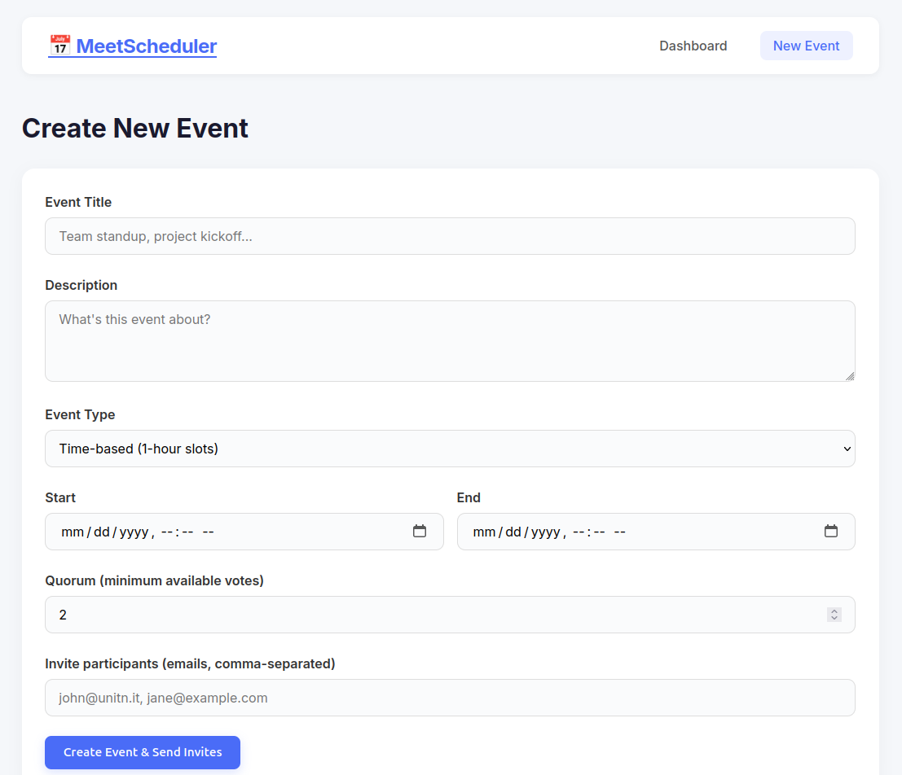

# MeetScheduler


MeetScheduler is a full-stack web app inspired by Doodle. It helps groups create meeting events, invite participants, collect availability, and identify the best time slot once enough people are available.

The project was built for **HackaPrompt AI 2026** at the **University of Trento**, a hackathon focused on building software with large language models and reflecting critically on AI-assisted programming.

## Screenshots





## Features

- Create time-based or full-day events
- Generate 1-hour slots automatically for time-based events
- Invite participants by email
- Collect participant responses: available, maybe, or unavailable
- Show responses in a color-coded availability grid
- Highlight the best slot when quorum is reached
- Connect Google Calendar to show busy periods

## Tech Stack

| Layer | Technology |
| --- | --- |
| Frontend | React 18, React Router, Vite, custom CSS |
| Backend | Node.js, Express |
| Data storage | Local JSON file storage |
| Calendar | Google Calendar API |
| Authentication | Google OAuth 2.0 |
| Email | Nodemailer with Gmail SMTP |

## Quick Start

### 1. Clone the project

```bash
git clone https://github.com/lewisndambiri/meeting-scheduler.git
cd meeting-scheduler
```

### 2. Install dependencies

```bash
cd server
npm install

cd ../client
npm install
```

### 3. Configure environment variables

Create a server environment file:

```bash
cd ../server
cp .env.example .env
```

Then update `.env` with your Google OAuth and Gmail app credentials:

```env
GOOGLE_CLIENT_ID=your-client-id.apps.googleusercontent.com
GOOGLE_CLIENT_SECRET=your-client-secret
GOOGLE_REDIRECT_URI=http://localhost:3001/api/auth/google/callback
BASE_URL=http://localhost:5173
EMAIL_USER=youremail@gmail.com
EMAIL_PASS=your-app-password
```

### 4. Run the app

Start the backend:

```bash
cd server
npm run dev
```

Start the frontend in another terminal:

```bash
cd client
npm run dev
```

Open `http://localhost:5173`.

## Project Structure

```text
meeting-scheduler/
├── client/
│   ├── index.html
│   ├── vite.config.js
│   └── src/
│       ├── App.jsx
│       ├── App.css
│       ├── api.js
│       ├── components/
│       │   └── Navbar.jsx
│       └── pages/
│           ├── Home.jsx
│           ├── CreateEvent.jsx
│           └── EventDetail.jsx
├── server/
│   ├── server.js
│   ├── config.js
│   ├── auth.js
│   ├── store.js
│   └── routes/
│       ├── auth.js
│       ├── calendar.js
│       ├── events.js
│       └── invite.js
├── docs/
│   └── assets/
└── README.md
```

## HackaPrompt AI 2026

HackaPrompt AI 2026 took place on **April 23, 2026** at **Polo Fabio Ferrari, Povo, Trento, Italy**. The challenge asked students to build software with the help of large language models while observing where AI tools are effective and where human review is still essential.

Key reflections from this project:

- AI tools were useful for quickly scaffolding React and Express code.
- Human review was still needed for security, environment setup, UX decisions, and project coherence.
- Integrations such as Google OAuth, Gmail SMTP, and calendar availability require careful manual configuration.
- Timezone handling, token storage, validation, and deployment choices remain important areas for future improvement.

## Future Improvements

- Replace JSON file storage with PostgreSQL or MongoDB
- Store OAuth tokens securely with sessions or a database
- Add participant authentication or magic links
- Improve timezone handling for international users
- Add automated tests for API routes and voting logic
- Add Docker support for easier deployment

## Author

**Lewis Ndambiri**

- Portfolio: [lewisndambiri.github.io](https://lewisndambiri.github.io)
- GitHub: [github.com/lewisndambiri](https://github.com/lewisndambiri)

## License

MIT
